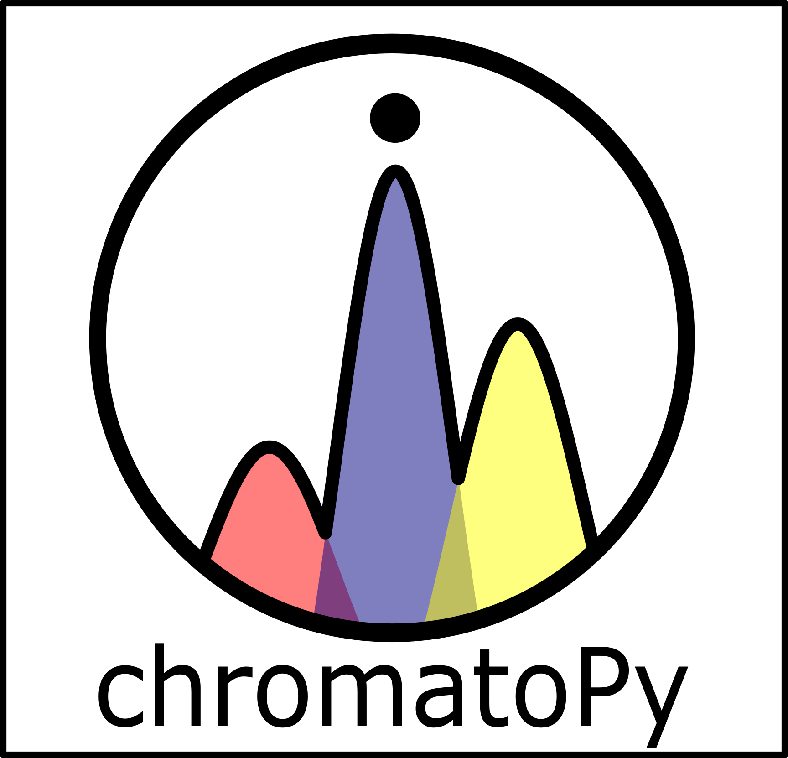

# chromatoPy (1.0.0) - standalone application

## Installation

Please contact Gerard Otiniano for an installable version of the app for macOS (.dmg is too large for GitHub). Alternatively, feel free clone the repository and build a working version of the app for any OS using briefcase.

## License

This project is licensed under the MIT License - see the [LICENSE](LICENSE) file for details.

## Contact

For questions or inquiries, please contact:

- Author: Dr. Gerard Otiniano & Dr. Elizabeth Thomas
- Email: gerardot@buffalo.edu
